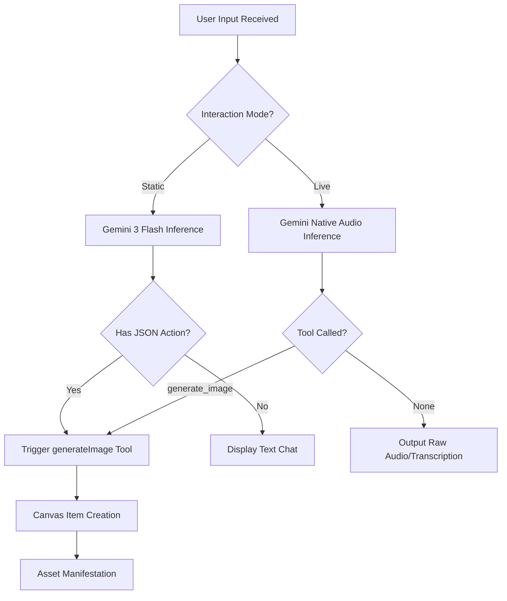

# AI Execution Process

The "Intelligence" of the studio is defined by how we handle model outputs.

## 1. Execution Logic Flow

## 2. Live Function Calling
In `services/gemini.ts`, we define a `generateImageTool`. This is a strict Schema (OpenAPI style) that the model understands.
**Why Function Calling?** Audio-to-text transcription can be messy. Function calls are structured and guaranteed to be valid, bypassing the flakiness of audio transcript parsing.

## 3. Image Generation Pipeline
We use a dedicated service for `gemini-2.5-flash-image`.
- **Format:** Returns Base64 strings.
- **MIME:** `image/png`.
- **Canvas Integration:** Uses a "Pending State" to ensure the UI feels responsive while the model works in the background (latency is usually 2-5s).
