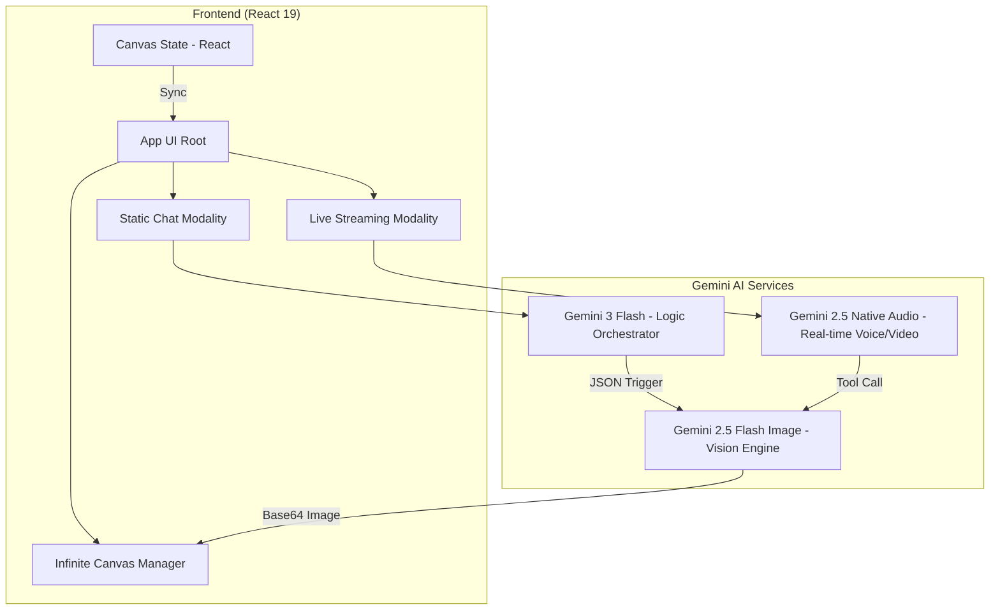

# System Architecture

Visionary Studio follows a **Hybrid Orchestration Architecture**. The frontend acts as the primary "Director," managing state and routing instructions to specialized AI models based on the interaction mode.

## 1. System Topology

## 2. Component Hierarchy
- **App (Root):** Central State Manager. Holds the `canvasItems` and `appMode`.
- **Canvas:** The "Entity Manager." Renders and handles physics/draggability for AI outputs.
- **SidePanel:** The "Command Center." Toggles between input modalities.
  - **StaticChat:** Request/Response logic for deep reasoning.
  - **LiveMode:** WebSocket-based streaming interface.

## 3. Communication Layer
- **Static Mode:** Uses standard HTTPS POST requests (Unary/Stream) via the SDK.
- **Live Mode:** Establishes a persistent WebSocket connection for bidirectional raw PCM audio and JPEG frame streaming.
