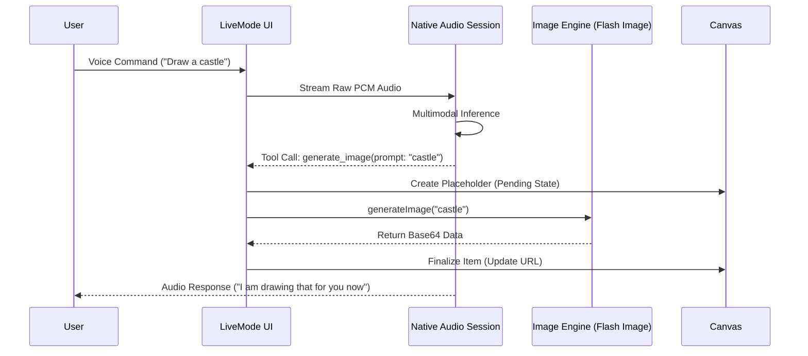

# Data Flow Analysis

The application manages two distinct data pipelines: **The Structured Pipeline** (Static) and **The Streaming Pipeline** (Live).

## 1. Live Mode Sequence (The "Tooling" Loop)

## 2. Static Mode Flow (JSON Parsing)
1. **Input:** User types "Draw a neon cat."
2. **Orchestration:** `gemini-3-flash` receives text + System Instruction.
3. **Reasoning:** Model decides to generate an image and outputs: `Here is your cat! { "action": "generate_image", "prompt": "neon cat" }`.
4. **Extraction:** Regex/JSON parser identifies the payload.
5. **Execution:** `generateImage()` service is called.
6. **Reconciliation:** Placeholder is added to Canvas -> Final URL replaces placeholder.
