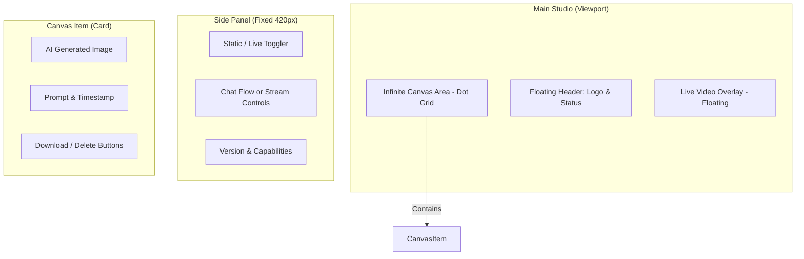

# UI Wireframes & Layout

The Studio uses a specialized glassmorphism layout designed for creative immersion.

## Layout Schema

## Design Principles
1. **Depth:** Uses `backdrop-blur-3xl` and `z-index` layering to separate the canvas from the command panel.
2. **Context:** Pending items show a specialized "Crafting" state with spinning loaders to reduce perceived latency.
3. **Responsive:** Side panel is optimized for desktop interaction, while the canvas supports multi-touch dragging.
